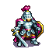

# LL Tactics

<code> Repositorio para la asignatura Ingeniería Web </code>

## Índice

1. [Descripción del proyecto](#1-descripción-del-proyecto)
2. [Cómo se usa](#2-cómo-se-usa)
3. [Créditos](#3-créditos)

> [!IMPORTANT]
> 4. [<u>MEJORAS</u>](#4-mejoras)

## 1. Descripción del proyecto
**LLTactics** es un juego web de fantasía medieval inspirado en el modelo autochess. En él, los jugadores compiten por la victoria comprando y mejorando personajes y objetos estratégicamente.

Las partidas se desarrollan en dos fases alternas:

- **Fase de compra**: Los jugadores pueden gastar estrellas para adquirir unidades y objetos, refrescar la tienda, asignar objetos a sus unidades o eliminar elementos de su inventario (mediante doble click).
- **Fase de batalla**: Los equipos se enfrentan de forma automática hasta que solo quedan unidades vivas de un bando. El jugador perdedor de la ronda pierde puntos de vida. El juego continúa hasta que uno de los jugadores alcanza cero (o menos) puntos de vida.

LLTactics cuenta con un sistema de matchmaking automático. Además, las partidas cuentan con un sistema de chat integrado para que los jugadores puedan comunicarse en tiempo real, así como un botón de reporte que permite denunciar comportamientos inapropiados y mantener una comunidad saludable.

Los jugadores también pueden acceder a diferentes vistas informativas y sociales:

- **Galería de objetos y héroes**: Muestra todos los héroes (ordenados por facciones) y objetos disponibles en el juego, junto con sus estadísticas y descripciones detalladas.
- **Ranking**: Presenta a los mejores jugadores del servidor, incluyendo sus estadísticas más destacadas. Esta vista es dinámica y permite hacer clic en cada jugador para acceder a su perfil.
- **Reglas**: Resume claramente las normas del juego para ayudar a nuevos y veteranos a comprender sus mecánicas.
- **Perfil de usuario**: Muestra información personalizada como la facción favorita del jugador, su personaje más usado, puntos de maestría, y porcentajes de victorias y derrotas.

Los administradores disponen de vistas y herramientas exclusivas para la gestión del entorno del juego:

- **Gestión de partidas y usuarios**: Permite revisar  partidas en curso o finalizadas, así como banear usuarios en caso de comportamiento indebido y desbanearlos.
- **Modificación de constantes del juego**: Posibilidad de ajustar parámetros iniciales de las partidas, como economía, vida base u otros factores clave.
- **Gestión de contenido**: Vista dedicada a añadir, modificar o eliminar héroes y objetos disponibles en el juego, manteniendo el equilibrio.

## 2. Cómo se usa

En la pantalla de inicio, se pueden introducir credenciales para acceder como:

- **Administrador de prueba**:

Usuario: <code>a</code>

Contraseña: <code>aa</code>

- **Usuario de prueba**:

Usuario: <code>b</code>

Contraseña: <code>aa</code>

**Nota** - No hemos podido realizar los tests relacionados con la partida debido a que karate no soporta dos drivers simultáneamente. Aún así, hemos realizado tests externos para toda la demás funcionalidad.

## 3. Créditos

**DESARROLLADORES**

- Samuel Carrillo
- David Cendejas
- Sandra Sanz
- Iván Toribio
- Javier Martín

**ARTE**
- Las imágenes de unidades y objetos provienen del juego [Battle for Wesnoth](https://github.com/wesnoth/wesnoth/tree/master), las cuales están licenciadas bajo la GNU General Public License (GPL).
- El resto de imágenes decorativas han sido generados con ChatGPT y posteriormente adaptados.
- Las fuentes tipográficas usadas en los títulos se han obtenido desde Google Fonts.
- Los iconos provienen del set de Bootstrap Icons, bajo licencia MIT.

## 4. MEJORAS

**Autor**
- Javier Martín Fuentes

**Cambios**

> [!IMPORTANT]
> 4. [<u>MEJORAS</u>](#4-mejoras)

> [!NOTE]
> Para probar los cambios, recomiendo primero jugar una partida y escribir algo en el chat antes de ver la vista de gestión de partidas.

- **[EXAMEN - PREGUNTA C]** Se ha añadido el **atributo <code>title</code>** a todos los elementos interactivos o informativos de la partida. Para los objetos y unidades se muestra, entre otros, sus estadísticas.
- **[EXAMEN - PREGUNTA D]** Se han implementado las **partidas privadas protegidas por contraseña**. Ahora cuando le das al botón de jugar puedes elegir entre la forma anterior (partida pública) o crear / unirte a una partida privada.
- **[EXAMEN - PREGUNTA E]** Se ha corregido la forma de **modificar la imagen** tanto de héroes como objetos para que sea posible añadir **recursos externos**.
- **[EXAMEN - PREGUNTA F]** La vista de información de las últimas partidas **ya estaba implementada** (Gestión > Partidas [VER SECCIÓN REGISTRO DE PARTIDAS]). No obstante, se han añadido dos nuevas columnas a la tabla: una que te indica si la partida es pública / privada y otra que contiene un botón que puedes ver el chat de esa partida (creo que es más útil para un administrador que ver los equipos que han batallado en cada ronda y la forma de implementarlo es bastante similar).

- Se ha añadido un botón en la partida para poder vender todas tus unidades y objetos.
- Se ha añadido en la vista de perfil un botón para que un usuario pueda ver su historial de partidas.
- Se ha corregido que cuando un usuario baneado intente acceder se muestre la vista baneado (creo que no es la forma más limpia de hacerlo pero funciona).
- Con respecto al comentario *"a veces se des-sincroniza la cantidad de estrellas que tiene cada jugador de una partida"* no he encontrado el error, ¿puede ser que te refieras a que al comienzo de una nueva ronda de compra se añaden estrellas a ambos jugadores para que puedan comprar?